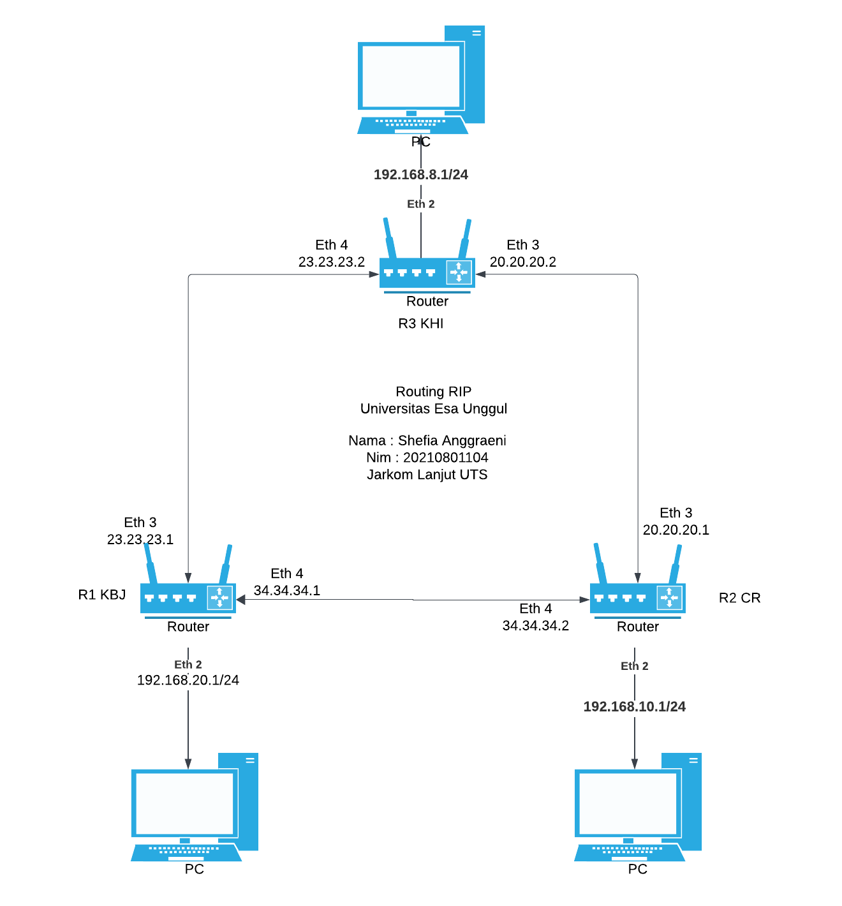

Nama : Shefia Anggraeni
Nim : 20210801104
kode Matakuliah : 8126
Mata Kuliah : Jaringan Komputer Lanjut

# 1. Jelaskan menurut anda apa itu Routing Static? #

   Jawab : Routing Static Menurut saya, routing static metode routing di mana jalur jaringan ditentukan dan dikonfigurasi secara manual oleh administrator jaringan. Ini berarti setiap rute yang akan dilalui oleh paket data dari satu titik ke titik lain di dalam jaringan perlu diatur secara manual. Routing static biasanya diterapkan pada jaringan yang sederhana dan stabil, karena metode ini tidak dapat menyesuaikan diri secara otomatis jika ada perubahan pada topologi jaringan. 

# 2. Jelaskan menurut anda apa itu Routing Dynamic? #
   Jawab : Routing dynamic metode routing yang lebih canggih di mana rute antar perangkat jaringan dikelola secara otomatis menggunakan protokol routing seperti OSPF (Open Shortest Path First), RIP (Routing Information Protocol), atau EIGRP (Enhanced Interior Gateway Routing Protocol). 

# 3. Jelaskan menurut anda apa itu Firewall? #
   Jawab : Menurut saya, firewall komponen penting dalam keamanan jaringan yang berfungsi untuk mengontrol dan memantau lalu lintas jaringan berdasarkan aturan yang telah ditetapkan. Firewall berperan sebagai penghalang antara jaringan internal dan jaringan eksternal, serta berfungsi untuk melindungi jaringan internal dari ancaman seperti serangan siber, virus, dan akses tidak sah. 

# 4. Jelaskan menurut anda apa itu NAT?#
   Jawab : Menurut saya, NAT (Network Address Translation) teknologi yang memungkinkan beberapa perangkat di dalam jaringan lokal untuk menggunakan satu alamat IP publik saat berkomunikasi dengan internet. Dengan menggunakan NAT, alamat IP privat dari perangkat-perangkat di jaringan lokal dapat disembunyikan, dan mereka semua bisa mengakses internet dengan alamat IP publik yang sama. Menurut saya, NAT ini sangat berguna dalam menghemat penggunaan alamat IP publik, karena tidak semua perangkat membutuhkan alamat IP publik yang unik. 

# CASED #

## PENJELASAN ##
# Konfigurasi Topologi Jaringan Menggunakan RIP #
Penjelasan Topologi
Topologi ini terdiri dari 3 router dan 3 PC yang masing-masing terhubung ke router dengan subnet yang berbeda. Protokol yang digunakan untuk routing antar-router adalah RIP.

# Komponen Utama #
3 Router:

R1 KBJ
R2 CR
R3 KHI

# 3 PC yang terhubung pada setiap router dengan subnet berbeda: #

PC dengan subnet 192.168.8.1/24 terhubung ke R3 KHI
PC dengan subnet 192.168.20.1/24 terhubung ke R1 KBJ
PC dengan subnet 192.168.10.1/24 terhubung ke R2 CR

# Subnet dan Interface #
# Router R1 KBJ #
Ethernet 2: Terhubung ke PC dengan subnet 192.168.20.1/24
Ethernet 3: Terhubung ke jaringan 23.23.23.1, menghubungkan ke R3 KHI
Ethernet 4: Terhubung ke jaringan 34.34.34.1, menghubungkan ke R2 CR
# Router R2 CR #
Ethernet 2: Terhubung ke PC dengan subnet 192.168.10.1/24
Ethernet 3: Terhubung ke jaringan 20.20.20.1, menghubungkan ke R3 KHI
Ethernet 4: Terhubung ke jaringan 34.34.34.2, menghubungkan ke R1 KBJ
# Router R3 KHI #
Ethernet 2: Terhubung ke PC dengan subnet 192.168.8.1/24
Ethernet 3: Terhubung ke jaringan 20.20.20.2, menghubungkan ke R2 CR
Ethernet 4: Terhubung ke jaringan 23.23.23.2, menghubungkan ke R1 KBJ

# Jaringan Antar-Router #
Jaringan 23.23.23.0/24: Menghubungkan R1 KBJ dan R3 KHI
Jaringan 20.20.20.0/24: Menghubungkan R2 CR dan R3 KHI
Jaringan 34.34.34.0/24: Menghubungkan R1 KBJ dan R2 CR

# Konfigurasi RIP #
Setiap router harus dikonfigurasi untuk mengenali jaringan langsung yang terhubung ke setiap interface-nya dan berbagi informasi routing melalui RIP.

